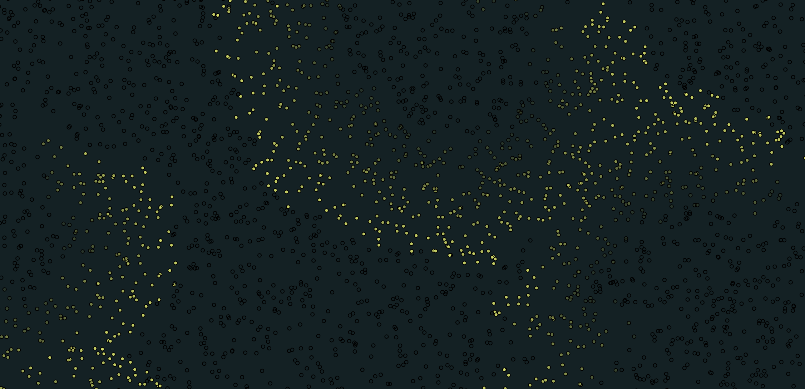

# Fireflies Simulation

This project simulates the behavior of fireflies. The fireflies mill around randomly, light up, and influence each other based on proximity.

[View simulation online](https://sleepokay.github.io/fireflies/)

## Operating

1. To run locally: open `index.html` in a web browser.
2. Use the "Colors" button to switch between different color sets.
3. Click on the canvas to manually activate fireflies.

## Configuration

For now, you can adjust various simulation parameters by directly editing the constants in `index.js`.

- `DIAMETER`: drawing diameter of the fireflies. Cosmetic only.
- `LIGHT_RADIUS`: radius within which fireflies see and influence each other.
- `CHART_HEIGHT` and `CHART_WIDTH`: Dimensions of the chart for tracking global sum of activation.
- `TOTAL_BUGS`: number of fireflies.
- `STARTING_ACTIVE`: initial probability of a firefly being active.
- `RANDOM_WALK_SCALE`: how far a firefly could randomly move in a given timestep.
- `DRAIN_RATE`: rate at which energy drains from active fireflies. Max energy is always 1
- `RECOVERY_RATE`: rate at which inactive fireflies recover energy. Max energy is always 1.